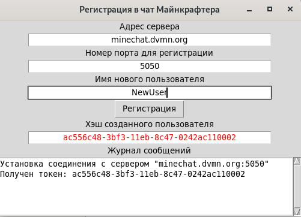
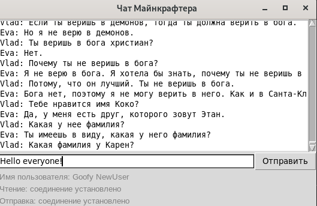

# Underground Chat Graphic User Interface

The asynchronous GUI client of the web chat.

## Project Goal
This is the training project created to improve the skills of asynchronous code.
The training courses for web-developers - [dvmn.org](https://dvmn.org/).

## Getting Started

### Prerequisites

Python v3.9 should be already installed. 
Afterwards you should verify if [Tkinter library](https://docs.python.org/3/library/tkinter.html)
 is properly installed on your system. 
On Python Wiki [the section "Checking your Tkinter support" ](https://wiki.python.org/moin/TkInter) 
 describes a way to check whether your Tkinter support is working.
In case of problems consider following [these instructions](https://stackoverflow.com/questions/25905540/importerror-no-module-named-tkinter).

### How to Install

1. Download this repository.
2. Use pip to install dependencies:
```bash
$ pip install -r requirements.txt
```
Consider that a virtual environment provides a better isolation.

### Quick Start

This repository contains two independent scripts.

A Linux command to run a sign up script:
```bash
$ python registration.py
```
The sign up window:



The sign up script returns a new user token. 
Afterwards you should use this token to run the chat: 
```bash
$ python main.py --host chat_host.org --port 1234 --token token 
```
You can set the input arguments as environment variables. 
See `python main.py --help` for more details.

A chat window:



## License

This project is licensed under the MIT License - see the [LICENSE](LICENSE) file for details.
